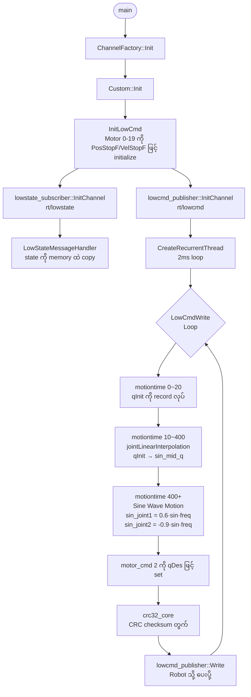
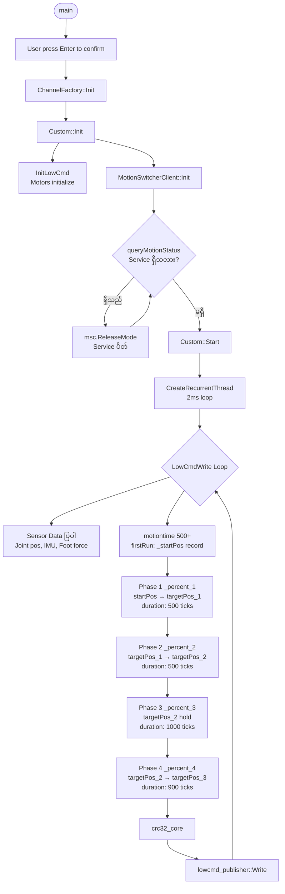
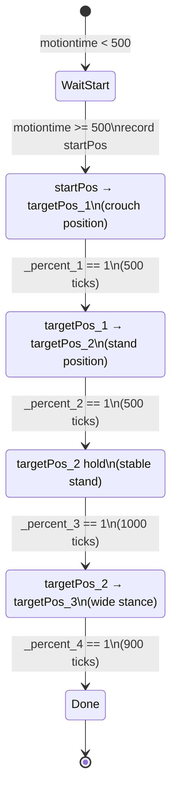
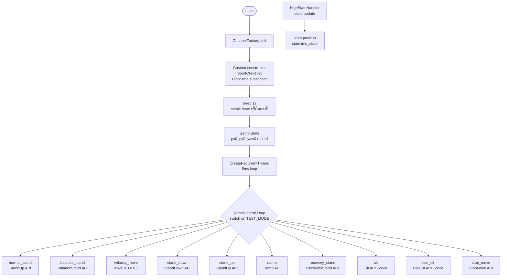
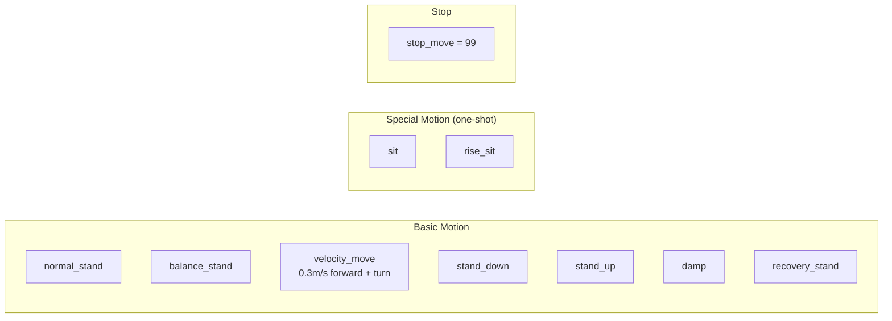
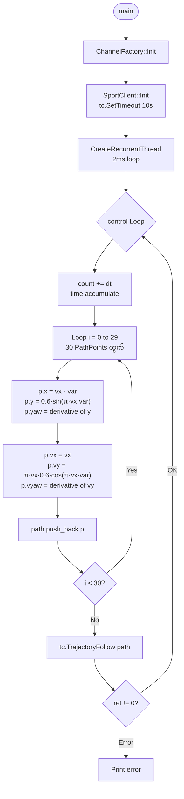
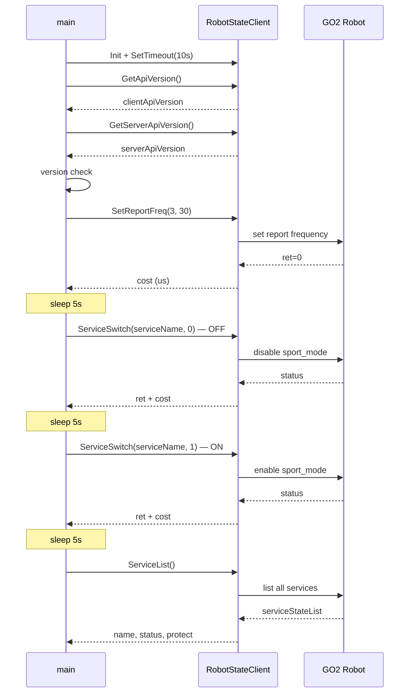
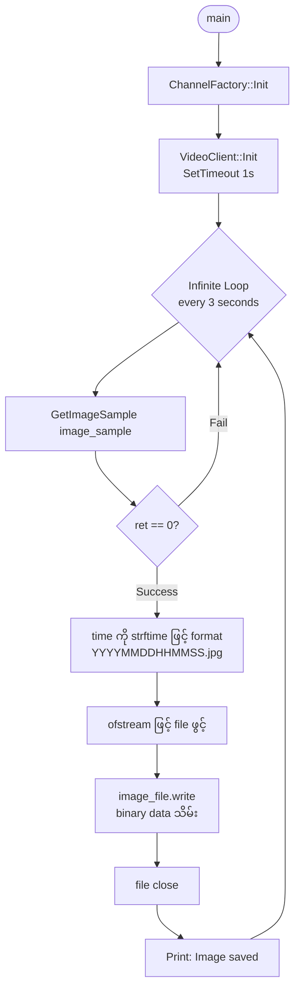
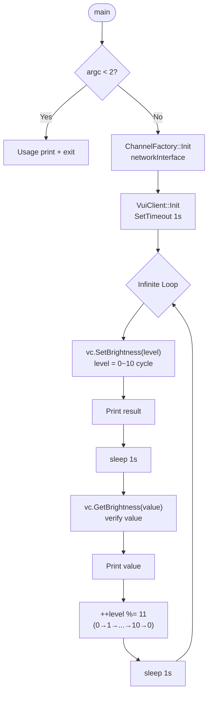
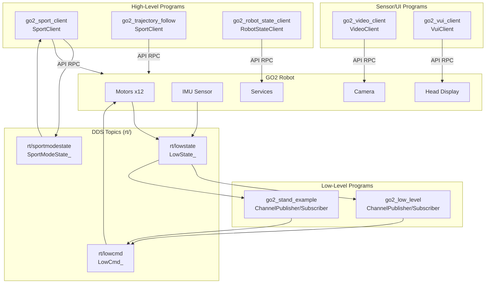

# GO2 Example Programs

Unitree GO2 robot ကို control လုပ်ရန် C++ example programs များ။ Program တစ်ခုချင်းစီ၏ function flow ကို Mermaid diagram ဖြင့် ရှင်းပြထားသည်။

---

## Program Overview

| File | Level | ရည်ရွယ်ချက် |
|------|-------|------------|
| `go2_low_level.cpp` | Low-level | Motor ကို တိုက်ရိုက် sine wave motion ဖြင့် ထိန်းချုပ်သည် |
| `go2_stand_example.cpp` | Low-level | Motor interpolation ဖြင့် stand-up sequence လုပ်သည် |
| `go2_sport_client.cpp` | High-level | SportClient API ဖြင့် motion mode များ ပြောင်းသည် |
| `go2_trajectory_follow.cpp` | High-level | Sine curve path ကို TrajectoryFollow API ဖြင့် လိုက်သည် |
| `go2_robot_state_client.cpp` | Service | Robot service များကို on/off ပြောင်းသည် |
| `go2_video_client.cpp` | Sensor | Camera ဓာတ်ပုံ ရိုက်ပြီး JPEG သိမ်းသည် |
| `go2_vui_client.cpp` | UI | Head display brightness ထိန်းချုပ်သည် |

---

## 1. go2_low_level.cpp — Low-Level Motor Sine Wave Control

Front-right leg ၏ motor (joint 2) ကို sine wave ဖြင့် တိုက်ရိုက် ထိန်းချုပ်သည်။ DDS publisher/subscriber ဖြင့် `rt/lowcmd` topic ကို write လုပ်သည်။



### Key Functions

| Function | ရှင်းလင်းချက် |
|----------|--------------|
| `Init()` | Publisher, Subscriber, Thread အားလုံး setup |
| `InitLowCmd()` | Motor 20 ခုကို safe default state ထားသည် |
| `LowStateMessageHandler()` | DDS မှ state data လက်ခံသည် |
| `jointLinearInterpolation()` | `rate` 0→1 ဖြင့် position တဖြည်းဖြည်း ပြောင်းသည် |
| `LowCmdWrite()` | 3-phase motion: record → interpolate → sine wave |
| `crc32_core()` | Command packet ၏ integrity စစ်သော CRC32 တွက်သည် |

---

## 2. go2_stand_example.cpp — Low-Level Stand-Up Sequence

MotionSwitcherClient ဖြင့် motion service ကို ပိတ်ပြီး၊ motor interpolation ဖြင့် 4-phase stand-up sequence လုပ်သည်။



### 4-Phase Motion Sequence



---

## 3. go2_sport_client.cpp — High-Level Sport Mode Control

SportClient API (High-level) ဖြင့် motion mode တစ်ခုကို `TEST_MODE` constant ဖြင့် ရွေးချယ်ပြီး run သည်။



### Available Motion Modes



---

## 4. go2_trajectory_follow.cpp — Sine Curve Trajectory Following

매 2ms မှာ 30-point sine curve path ကို တွက်ပြီး `TrajectoryFollow` API သို့ ပေးပို့သည်။



### Sine Curve Path (30 PathPoints)

```mermaid
xychart-beta
    title "Trajectory Path (x vs y)"
    x-axis "x (m)" [0, 0.5, 1.0, 1.5, 2.0, 2.5, 3.0]
    y-axis "y (m)" [-0.6, -0.3, 0, 0.3, 0.6]
    line [0, 0.37, 0.6, 0.37, 0, -0.37, -0.6]
```

> Path formula: `y = 0.6 · sin(π · vx · t)` — Robot သည် sine curve ကို လိုက်သွားသည်

---

## 5. go2_robot_state_client.cpp — Robot Service Manager

`RobotStateClient` ဖြင့် robot ၏ service (sport_mode, ai_sport, ...) များကို on/off ပြောင်းပြီး list ကြည့်သည်။



---

## 6. go2_video_client.cpp — Camera Image Capture

Robot ၏ built-in camera မှ JPEG image ကို 3 seconds တစ်ခါ capture ပြီး file သိမ်းသည်။



---

## 7. go2_vui_client.cpp — VUI Brightness Control

Robot ၏ head display brightness ကို 0~10 level ဖြင့် ချိန်ညှိသည်။



---

## Architecture Overview — DDS Communication

Program အားလုံး Unitree DDS (Data Distribution Service) ကို သုံးပြီး robot နှင့် communicate လုပ်သည်။


