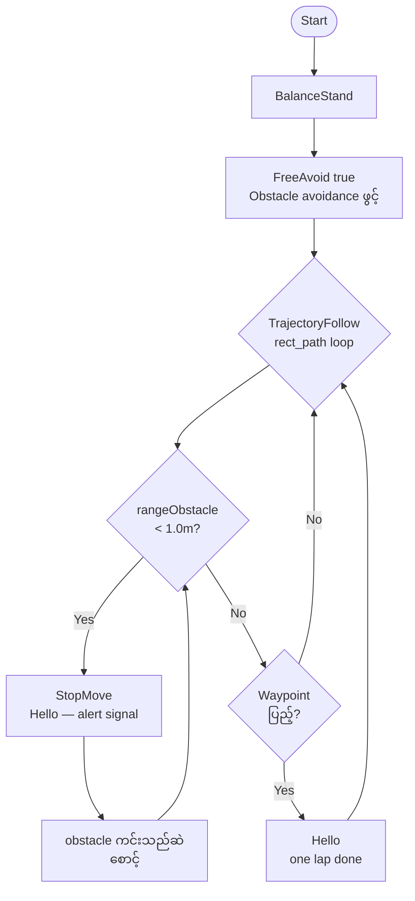
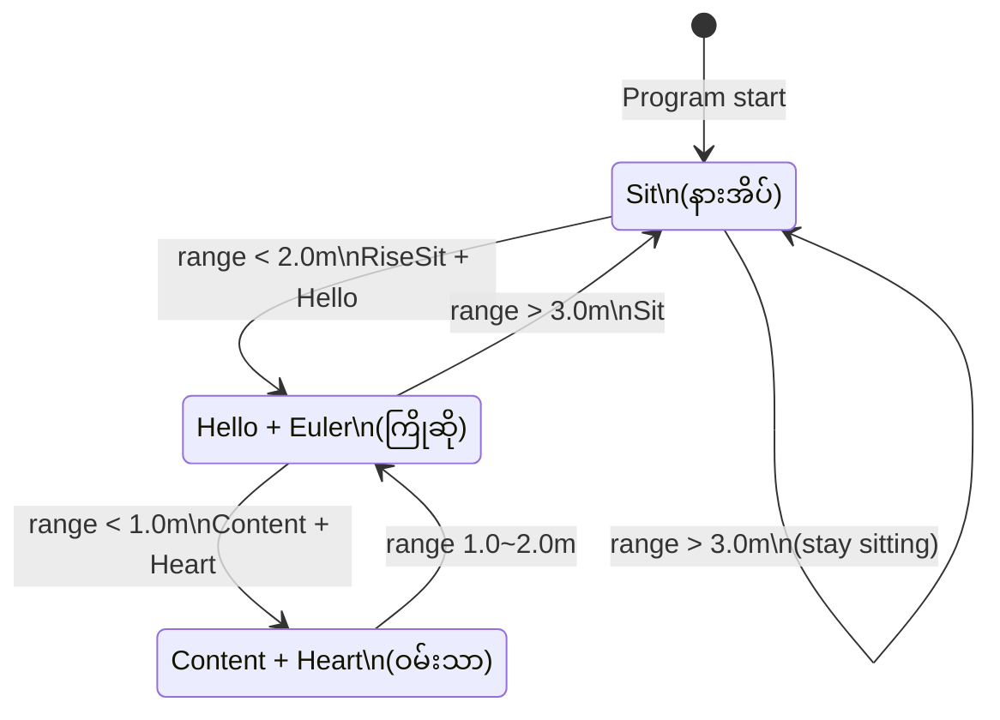
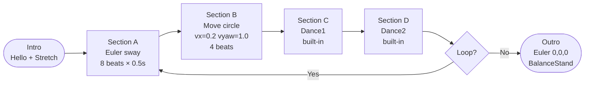

# GO2 SportClient API — Extra Ideas (အပိုဆောင်း စိတ်ကူးများ)

`go2_sport_client` API ကိုသုံးပြီး တည်ဆောက်နိုင်သော creative program idea ၃ မျိုး။

---

## Idea 1 — Auto Security Patrol (အလိုအလျောက် လုံခြုံရေး ကင်းလှည့်)

Robot သည် သတ်မှတ်ထားသော ဧရိယာကို ပတ်လည် ကင်းလှည့်ပြီး obstacle ရှိပါက ရပ်ကာ signal ပေးသည်။

### သုံးမည့် API

| API | ရည်ရွယ်ချက် |
|-----|------------|
| `TrajectoryFollow(path)` | Rectangle path ကို generate ပြီး loop လည်သည် |
| `state.rangeObstacle()` | ရှေ့/နောက်/ဘယ်/ညာ obstacle တိုင်းတာသည် |
| `FreeAvoid(true)` | Obstacle ရှောင်ရှားမှု mode ဖွင့်သည် |
| `Hello()` | ကင်းတစ်ပတ်ပြည့်သောအခါ လက်ဝှေ့ signal ပေးသည် |
| `state.position()` | လက်ရှိ position track လုပ်ကာ waypoint စစ်သည် |

### Program Flow



### Code Skeleton

```cpp
#include <unitree/robot/go2/sport/sport_client.hpp>
#include <unitree/robot/channel/channel_subscriber.hpp>
#include <unitree/idl/go2/SportModeState_.hpp>

// Rectangle patrol path: 4m x 3m loop
std::vector<unitree::robot::go2::PathPoint> buildPatrolPath(float cx, float cy) {
    // 4 corners → 30 interpolated points
    std::vector<unitree::robot::go2::PathPoint> path;
    // ... generate waypoints along rectangle
    return path;
}

void patrol(unitree::robot::go2::SportClient& sc,
            unitree_go::msg::dds_::SportModeState_& state) {
    // Check obstacle
    auto obs = state.range_obstacle();
    bool blocked = (obs[0] < 1.0f || obs[1] < 1.0f ||
                    obs[2] < 1.0f || obs[3] < 1.0f);
    if (blocked) {
        sc.StopMove();
        sc.Hello(); // alert
        return;
    }
    auto path = buildPatrolPath(state.position()[0], state.position()[1]);
    sc.TrajectoryFollow(path);
}

int main(int argc, char** argv) {
    unitree::robot::ChannelFactory::Instance()->Init(0, argv[1]);
    unitree::robot::go2::SportClient sc;
    sc.SetTimeout(10.0f);
    sc.Init();
    sc.FreeAvoid(true);
    sc.BalanceStand();
    // subscribe state + loop patrol ...
}
```

---

## Idea 2 — Proximity Greeting Robot (နီးကပ်မှု သိ၍ ကြိုဆိုသော ရိုဘော့)

လူတစ်ယောက် robot နားကို ချဉ်းကပ်လာသောအခါ ကြိုဆိုသည်။ ထပ်မံချဉ်းကပ်ပါက ဝမ်းမြောက်ဟန် ဟန်ဆောင်သည်။ ဝေးသွားသောအခါ ပြန်ထိုင်နားအိပ်သည်။

### သုံးမည့် API

| API | ရည်ရွယ်ချက် |
|-----|------------|
| `state.rangeObstacle()` | လူ၏ ကွာဟချက် စစ်သည် |
| `Hello()` | ချဉ်းကပ်လာသောအခါ လက်ဝှေ့ ကြိုဆိုသည် |
| `Content()` | ပိုနီးကပ်ပါက ဝမ်းသာဟန် ပြသည် |
| `Heart()` | အနီးဆုံး range တွင် paw ဖြင့် heart ပြသည် |
| `Euler(roll, pitch, yaw)` | ခေါင်းကို ကျူးမြောင်ကြည့်သည် |
| `Sit()` / `RiseSit()` | လူမရှိ → ထိုင်နားယူ၊ ပြန်ရောက် → ထသည် |

### State Machine



### Code Skeleton

```cpp
enum ProximityState { IDLE, GREETING, HAPPY };

void updateState(unitree::robot::go2::SportClient& sc,
                 float minRange, ProximityState& cur) {
    if (minRange > 3.0f && cur != IDLE) {
        sc.Sit();
        cur = IDLE;
    } else if (minRange < 2.0f && minRange >= 1.0f && cur == IDLE) {
        sc.RiseSit();
        sleep(2);
        sc.Hello();
        sc.Euler(0.1f, 0.0f, 0.0f); // tilt head
        cur = GREETING;
    } else if (minRange < 1.0f && cur != HAPPY) {
        sc.Content();
        sleep(1);
        sc.Heart();
        cur = HAPPY;
    } else if (minRange >= 1.0f && cur == HAPPY) {
        cur = GREETING;
    }
}
```

---

## Idea 3 — Music Beat Dancer (တေးဂီတ Beat နှင့် Synchronize သော ကခုန် ရိုဘော့)

Predefined timing sequence ဖြင့် music beat အပေါ် အခြေခံ၍ robot ကို ကပြစေသည်။ Body roll/pitch ဖြင့် beat ကို ဟန်ကျကျ ပြသပြီး dance sequence ကို loop လည်သည်။

### သုံးမည့် API

| API | ရည်ရွယ်ချက် |
|-----|------------|
| `BalanceStand()` | Dance အတွက် balance mode ဝင်သည် |
| `Euler(roll, pitch, yaw)` | Beat တစ်ချက်စီ body ယမ်းသည် |
| `Dance1()` / `Dance2()` | Built-in dance sequence play သည် |
| `Move(vx, vy, vyaw)` | Beat ပေါ် မူတည်ကာ ဝိုင်းပတ် ရွှေ့သည် |
| `SpeedLevel(1)` | Fast beat mode |
| `Hello()` + `Stretch()` | Intro / Outro action |

### Dance Sequence Flow



### Code Skeleton

```cpp
// BPM 120 → beat interval = 500ms
const int BEAT_US = 500000;

void sectionA_sway(unitree::robot::go2::SportClient& sc) {
    // 8 beats: body sways left-right with roll
    for (int beat = 0; beat < 8; beat++) {
        float roll  =  0.3f * sin(beat * M_PI / 2.0f);
        float pitch =  0.15f * cos(beat * M_PI / 2.0f);
        sc.Euler(roll, pitch, 0.0f);
        sc.BalanceStand();
        usleep(BEAT_US);
    }
}

void sectionB_circle(unitree::robot::go2::SportClient& sc) {
    // 4 beats: circle walk
    for (int beat = 0; beat < 4; beat++) {
        sc.Move(0.2f, 0.0f, 1.0f); // forward + yaw turn
        usleep(BEAT_US);
    }
    sc.StopMove();
}

int main(int argc, char** argv) {
    unitree::robot::ChannelFactory::Instance()->Init(0, argv[1]);
    unitree::robot::go2::SportClient sc;
    sc.SetTimeout(10.0f);
    sc.Init();
    sc.SpeedLevel(1);

    // Intro
    sc.Hello();   sleep(3);
    sc.Stretch(); sleep(3);
    sc.BalanceStand();

    // Dance loop (3 rounds)
    for (int i = 0; i < 3; i++) {
        sectionA_sway(sc);
        sectionB_circle(sc);
        sc.Dance1(); sleep(5);
        sc.Dance2(); sleep(5);
    }

    // Outro
    sc.Euler(0.0f, 0.0f, 0.0f);
    sc.BalanceStand();
    return 0;
}
```

---

## နှိုင်းယှဉ်ချက်

| | Idea 1 — Patrol | Idea 2 — Greeting | Idea 3 — Dancer |
|---|---|---|---|
| **အသုံးဝင်မှု** | Security / Inspection | Interactive demo | Entertainment / Exhibition |
| **API အခက်အခဲ** | TrajectoryFollow + State | rangeObstacle + State machine | Euler timing + Dance API |
| **Hardware လိုအပ်ချက်** | LiDAR obstacle data | LiDAR obstacle data | မလိုအပ်ဘူး |
| **Gait mode** | FreeAvoid + Agile | BalanceStand + Sit | BalanceStand |
| **အန္တရာယ်ကင်းမှု** | Medium — outdoor ကင်းလှည့် | Low — indoor static | Low — indoor |
