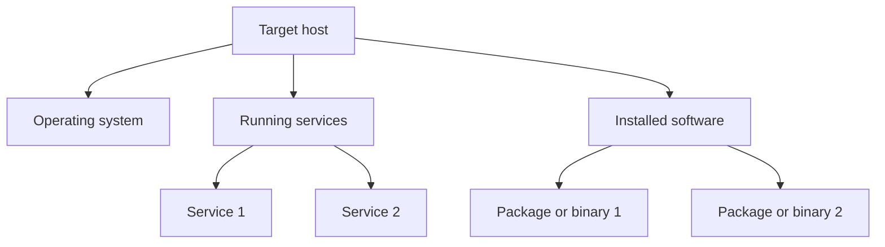

# 02 Target Analysis

ဒီ document က authorized assessment result တွေကို စနစ်တကျ စုရေးဖို့ template ဖြစ်တယ်။ Live reconnaissance ကို ဒီ file ထဲမှာ မလုပ်ထားဘဲ, already-approved output, console logs, screenshots, service banners, package inventory, system facts တို့ရှိပြီးသားဆိုရင် အဲဒီ evidence တွေကို အခြေခံပြီး analysis ဖြည့်ရန် ရည်ရွယ်ထားတယ်။

## Scope

| Field | Value |
| --- | --- |
| Target name | `TBD` |
| Target type | `localhost / VM / robot / server / container` |
| Ownership / authorization | `TBD` |
| Assessment date | `2026-06-16` |
| Analyst | `TBD` |
| Evidence source | `authorized logs / screenshots / package list / service status output` |

## Executive Summary

ဒီ section မှာ target ရဲ့ overall posture ကို 3-5 ကြောင်းနဲ့ အကျဉ်းချုပ်ရေးပါ။ ဥပမာ:

- ဘယ် OS family ဖြစ်နိုင်တယ်
- ဘယ် service groups တွေတွေ့ထားတယ်
- ဘယ် components တွေ version-identifiable ဖြစ်တယ်
- ဘယ် data points တွေ confirm မဖြစ်သေးဘူး

ရေးရန်:

`TBD`

## Evidence Inventory

ဒီ section မှာ analysis လုပ်ရာမှာသုံးထားတဲ့ evidence တွေကို register လုပ်ပါ။

| Evidence ID | Type | Source | Notes |
| --- | --- | --- | --- |
| E-01 | `text output` | `TBD` | `TBD` |
| E-02 | `screenshot` | `TBD` | `TBD` |
| E-03 | `config file` | `TBD` | `TBD` |

## Target Profile

### Identity

| Attribute | Observed value | Confidence | Basis |
| --- | --- | --- | --- |
| Hostname | `TBD` | `Low/Med/High` | `TBD` |
| Environment | `physical / VM / container / embedded` | `Low/Med/High` | `TBD` |
| Primary purpose | `TBD` | `Low/Med/High` | `TBD` |

### Platform Summary

| Category | Observed value | Confidence | Notes |
| --- | --- | --- | --- |
| OS family | `TBD` | `Low/Med/High` | `e.g. Linux-like / Debian-like / Ubuntu-like` |
| Kernel / OS version | `TBD` | `Low/Med/High` | `TBD` |
| CPU architecture | `TBD` | `Low/Med/High` | `x86_64 / arm64 / aarch64 / ...` |
| Init / service manager | `TBD` | `Low/Med/High` | `systemd / busybox / other` |
| Network role | `TBD` | `Low/Med/High` | `workstation / controller / gateway / sensor host` |

## Software and Services Summary

### Observed Services

| Service name | Port / socket | Protocol | State | Product / software | Version | Evidence | Notes |
| --- | --- | --- | --- | --- | --- | --- | --- |
| `TBD` | `TBD` | `TBD` | `open / listening / active` | `TBD` | `TBD` | `E-xx` | `TBD` |

### Local System Software

| Software | Version | Role | Evidence | Notes |
| --- | --- | --- | --- | --- |
| `TBD` | `TBD` | `TBD` | `E-xx` | `TBD` |

## Component-Level Analysis

### Operating System

- Observed indicators: `TBD`
- Most likely platform: `TBD`
- Alternative interpretations: `TBD`
- Confidence rationale: `TBD`

### Network-Exposed Services

Service တစ်ခုချင်းစီအတွက် အောက်ပါ format နဲ့ရေးနိုင်တယ်:

#### Service: `TBD`

- Role: `TBD`
- Listening endpoint: `TBD`
- Product identification: `TBD`
- Version evidence: `TBD`
- Authentication surface: `TBD`
- Exposure concern: `TBD`

### Locally Installed or Bundled Software

- `TBD`

## Version Confidence Matrix

Version attribution က banner, package metadata, process strings, config headers, file names စတဲ့ evidence အမျိုးအစားပေါ်မူတည်ပြီး confidence ခွဲထားဖို့ကောင်းတယ်။

| Item | Claimed version | Confidence | Why |
| --- | --- | --- | --- |
| `TBD` | `TBD` | `Low/Med/High` | `TBD` |

## Relationships and Architecture Notes

အောက်က diagram ကို target environment ကိုနားလည်ဖို့ logical map အနေနဲ့ ဖြည့်သုံးနိုင်တယ်။

ရေးရန်:

- Main control plane: `TBD`
- Data plane or sensor interfaces: `TBD`
- Remote management path: `TBD`
- Dependencies between services: `TBD`

## Findings

ဒီ section မှာ vulnerability write-up မဟုတ်ဘဲ footprinting result မှတဆင့် တွေ့ရတဲ့ operational/security-relevant observations ကိုရေးပါ။

| ID | Finding | Severity | Evidence | Notes |
| --- | --- | --- | --- | --- |
| F-01 | `TBD` | `Info / Low / Med / High` | `E-xx` | `TBD` |

## Unknowns and Gaps

- `TBD`
- `TBD`

## Recommended Next Validation Steps

ဒီနေရာမှာ live probing command မဟုတ်ဘဲ authorized follow-up data collection items ကိုရေးပါ။

1. Package manifest, service unit files, or container metadata ကိုခွင့်ပြုထားသလို review လုပ်ရန်
2. Confirmed logs သို့မဟုတ် admin-provided screenshots ဖြင့် version claims ကို cross-check လုပ်ရန်
3. Exposure scope ကို architecture owner နဲ့ confirm လုပ်ရန်

## Final Assessment

- Overall platform identification: `TBD`
- Highest-confidence software identifications: `TBD`
- Least-certain assumptions: `TBD`
- Whether more evidence is needed: `Yes / No`
